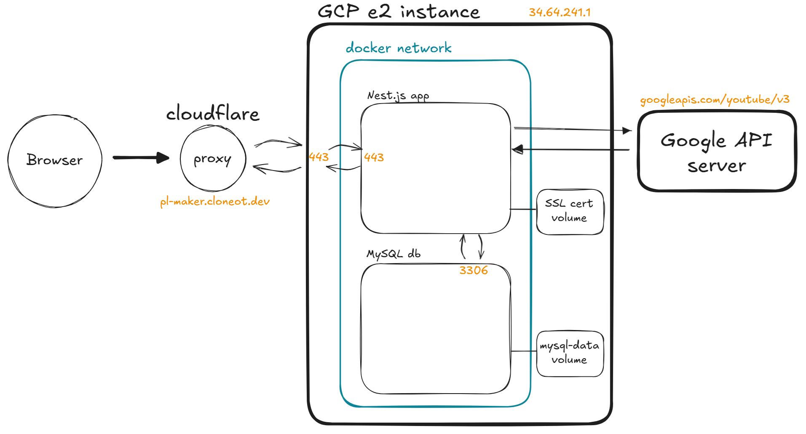
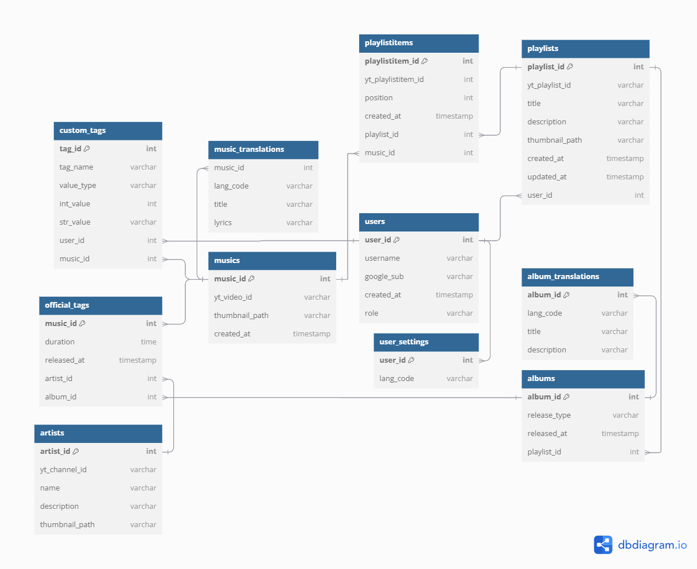

## Description

사용자가 직접 노래(유튜브 뮤직)에 태그를 붙이고, 태그를 기준으로 원하는 곡만 필터링하여 유튜브 재생목록을 만들 수 있습니다. 

gmail, solved.ac처럼 복잡한 쿼리를 처리하는 것을 목표로 합니다. 

- [ ] filter
  - [ ] boolean tag 조건 (e.g., `band`, `favorite`, ...)
  - [ ] key:value exact same 조건 (e.g., `genre:rock`)
  - [ ] 논리 AND, OR, NOT 연산 (e.g., `genre:rock || (genre:pop && favorite)`)
  - [ ] numeric range 조건 (e.g., `bpm:100..120`)
- [ ] query
  - [ ] full text search (e.g., `lyrics:높은 마음으로 살아야지 낮은 몸에 갇혀있대도`)

## Architecture
Nest.js(typescript), MySQL, TypeORM, Docker를 사용합니다. 

DB쪽 스택은 변경될 가능성이 높습니다. 

## API Specs
프론트엔드 단에서 필요한 내용을 [API.md](./API.md)에 정리해두었습니다. 

프로토타입이 어느 정도 완성되면, OpenAPI v3 기반의 [swagger](https://github.com/swagger-api/swagger-ui), [redoc](https://github.com/Redocly/redoc), [elements](https://github.com/stoplightio/elements) 중 하나를 도입할 계획입니다. 

## DB diagrams
dbdiagram.io로 만든 나이브한 다이어그램입니다. ([링크](https://dbdiagram.io/d/playlist-maker-67aa14bc263d6cf9a0a51ad6))

주의: 1 to 1 관계, composite PK 등을 표현할 수 없어 다이어그램이 정확하지 않습니다. 

custom_tags에 대한 검색을 효율적으로 수행하기 위해 NoSQL 도입을 생각 중입니다. (MongoDB 또는 Elasticsearch)

구현된 스키마는 다음과 같습니다:
- [x] users
- [x] musics (music)
- [x] playlists
- [x] playlistitems
- [x] custom_tags (tags)
- [ ] official_tags
- [ ] music_translations
- [ ] user_settings
- [ ] artists
- [ ] albums
- [ ] album_translations
